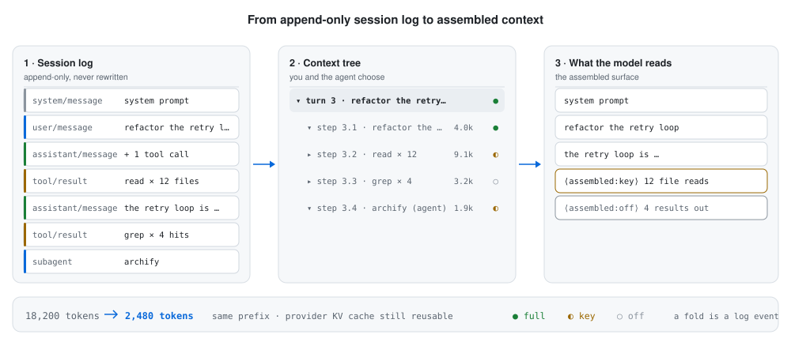

<div align="center">

# Assembled Context

**Turn the context window from a length into a set of decisions.**

A DeepSeek Harness client plugin that keeps a checkable tree over the session log,
so you — and the agent itself — choose what the next request actually contains.

[](LICENSE)
[](#install)
[](package.json)
[](https://github.com/catsenior507/dsh-context-assembler/stargazers)

[English](README.md) · [简体中文](README.zh.md)

</div>

<picture>
  <source media="(prefers-color-scheme: dark)" srcset="assets/assembled-context-dark.svg">
  
</picture>

---

## The problem

Harness gives you exactly two context states: **everything**, or whatever `dsh-compaction-basic`
compresses into a summary you never see and cannot adjust. On a long task that is bad:
a 4,000-token `grep` dump, a stack trace you already diagnosed, a sub-task that finished and
shipped — all of them keep occupying the window until a threshold fires a compaction you can
neither inspect nor undo.

This plugin turns "context" from **a length** into **a set of decisions**.

## How it works

A harness session is an append-only event log, and what the model reads is a **surface
projection** of it: `system/message`, `user/message`, `assistant/message` and `tool/result`
events in order form the surface, and `session.deriveMessages()` folds that surface into the
message array sent to the provider.

Harness gives producers exactly **one** structural operation:

```text
{ op: "replace", startSeq, endSeq }
```

It replaces that span of the **current surface order** with **one** message node of its own,
leaving every other node exactly where it was. Compaction is built on it. This plugin turns the
same operation into an interactive editor:

| Mode | Meaning | Surface effect |
| --- | --- | --- |
| **full** | keep verbatim | no replacement |
| **key** | keep the point | the span becomes **one summary message** (written by the agent or the host) |
| **off** | drop from context | the span becomes a very short marker (configurable down to zero tokens) |

Because only the folded spans are replaced and every other node keeps its position,
**the untouched prefix stays reusable by the provider's KV cache**.

## Three design decisions

### 1. The tree is a *read* of the log, not plugin state

Every time the panel opens it re-derives the surface from the session log and rebuilds the whole
tree. So:

- resuming a session, switching processes, or the agent having folded something itself all look
  identical to the panel;
- a checkbox always means "what the model will actually receive", never "what the plugin
  remembered last time";
- after the plugin is removed the log is still self-consistent and harness replays it correctly.

### 2. Tool calls and results are atomic

Providers reject two malformed shapes: a `tool-call` with no matching result, and a result with no
matching call. Folding spans are therefore extended to whole tool-call groups. The one exception is
**folding a single tool result**, where the plugin emits a `tool/result` replacement (content only —
`toolCallId` is untouched), so the pairing stays complete.

### 3. Expanding is single-node only, and the plugin says so

Surface replacement is N→1, and an `assistant/message` can never be a replacement node (it embeds a
provider stream, and harness forbids it from carrying `sourceEventSeqs`). So **a multi-node fold
cannot be restored perfectly**. The plugin's contract:

- a fold covering **one** event (the most common case: a single tool result) → restored **verbatim**,
  same role, same content;
- a fold covering several events → restored as **one full replay message with separators** (text is
  lossless, roles are flattened, and the message says so at the top).

The panel labels this explicitly instead of pretending it can "undo".

## Install

```powershell
# from a local checkout
npm install; npm run build
dsh plugin --profile web add <path-to-this-repo>

# or straight from git
dsh plugin --profile web add https://github.com/catsenior507/dsh-context-assembler
```

Then **restart dsh web** so it loads — the [dsh-web-watchdog](https://github.com/catsenior507/dsh-web-watchdog) panel's restart
button is the quick way.

## Using it

### The panel

A floating **Assembled Context** button appears in the bottom-right corner (shortcut `Ctrl+Shift+K`).
Opening it gives you:

- **Session picker** — defaults to the most recently active session; subagent sessions are listed
  separately, because they have their own surface.
- **Stats bar** — visible / folded / original tokens, tokens saved, surface nodes, assembly regions.
- **The tree** — turn → step → system prompt / user message / assistant message / tool result. A tool
  node nests the **subagent sessions** it spawned. A folded node appears as an "assembly region" that
  expands to the raw events it covers.
- **Every row says what the step *was***, even when folded — the turn and step rows carry the first
  line of real content from that region:

  ```text
  ▾ turn  3   refactor the retry loop and stop the double-charge…      16.5k t
    ▸ step  3.1  refactor the retry loop and stop the double-charge…   4.0k t
    ▸ step  3.2  tool run_code · type updated 8421                     355 t
    ▸ step  3.5  Now update the panel to render `node.hint`, add CSS…  1.5k t
  ```

  The rule is "the first line of the first non-system node in line order", with two exceptions worth
  stating: **the rendered system prompt is skipped** (it is ~1.2k tokens and identical in every
  session, so using it as a label is the same as having no label — it is only the fallback when a
  region is otherwise empty), and **tool-call marker lines are skipped** (`<run_code {"code": …}>`),
  otherwise a tool-only step would display a wall of JSON arguments, which is worse than nothing;
  in that case the tool result's first line is used, prefixed with the tool name.
- **A three-state switch on every row** — `full` / `key` / `off`. Summary rows (turn, step, subagent)
  offer the same for their entire subtree.
- **Toolbar** — `tool results → key`, `assistant messages → key`, `everything off`, `expand all`.
- **Model view** — the messages the model is actually receiving right now, in derived order.
- **Presets** — rules (match on kind / tool name / failed / label regex → mode + digest template).
- **Footer** — `Preview` (dry-run, writes nothing) and `Apply` (appends to the session log).

Every checkbox lives in browser memory until you press **Apply**.

### The agent-side tool `context_assembler`

Registered for the model, with four actions:

| action | effect |
| --- | --- |
| `tree` | read the context tree: each row's `surfaceSeq`, kind, current mode, estimated tokens |
| `set` | change modes by `surfaceSeq`; the `digest` is written by the model itself; `dryRun` previews |
| `preset` | write rule presets for this session, for the user to apply with one click |
| `messages` | inspect the messages the model is actually receiving, with token totals |

This is what makes **pre-authored context** possible: after a sub-task ships, or after an error has
been ruled out, the agent folds that history into a one-line conclusion itself, instead of waiting for
a threshold to fire a compaction it does not control.

### Configuration (the profile row's `config`)

```yaml
- id: ui-context-assembler
  name: '@dsh-external/dsh-client-plugin-context-assembler'
  config:
    port: 4799                 # loopback API port when no webServer is available
    offMarker: "（{count} items removed from context, ~{tokens} tokens）"  # set to "" for a truly zero-token off
    digestHeadLines: 12        # head lines kept by the automatic digest
    digestTailLines: 4         # tail lines kept by the automatic digest
    digestMaxChars: 6000       # per-digest character cap
    exposeTool: true           # register the context_assembler tool
```

A preset rule with `auto: true` applies itself at the end of every turn (`turn/end`). Every built-in
template ships disabled.

## How the automatic digest is written

When no `digest` is supplied, the host generates one with a deliberately mechanical rule: keep the
**conclusion** (member count, failure state), the **first N lines** of the body (usually what
happened) and the **last M lines** (usually the outcome), and replace the middle with
`… (K lines omitted) …` — so the model knows both that something was omitted and how much.

When the agent passes a `digest` through the tool, the summary is the model's own semantic
conclusion — which is the most valuable part of pre-authored context.

## Repository layout

| File | Responsibility |
| --- | --- |
| `src/host/surface.ts` | surface folding and per-node message projection (pure functions, browser/Node) |
| `src/host/tree.ts` | log → context tree (turn/step/tool/subagent grouping, state and token stats) |
| `src/host/planner.ts` | assemble modes → surface replace ops (group merging, tool-pair repair, digest rendering, expansion) |
| `src/host/service.ts` | host orchestration: read the tree, commit plans, persist presets, mount subagents |
| `src/host/api.ts` | HTTP surface (webServer route, or its own loopback port) |
| `src/host/tool.ts` | the `context_assembler` tool definition (raw JSON Schema) |
| `src/index.ts` | plugin entry (cordis `inject`, both assembly paths, optional auto-presets) |
| `src/client/` | the browser panel (React, from the shell module table) |

## Constraints worth knowing

### Client-side

**The stylesheet filename is load-bearing.** External plugin client packages share one build preset
that hashes each stylesheet by a "relative to repo root" virtual id and prefixes every class name with
it (`[hash]_[local]`). Every plugin that names its stylesheet `src/client/styles.module.css` therefore
gets the **same hash prefix** — an earlier build of this plugin and the `igem-manager` plugin both
produced `._0K34_a_launcher`, and that plugin's 52×52 round-icon rule squashed this launcher into a
circle with overflowing text. In the other direction, the generic class names in that stylesheet
(`.panel`, `.button`, `.row`, `.label`, `.title`, `.header`, `.footer`, `.preview`, `.section`,
`.mode`, `.tag`, `.select`) were polluting *its* interface — the two builds shared seven local class
names: launcher, panel, title, spacer, row, select, empty.

Renaming the stylesheet to `context-assembler.module.css` yields a unique hash **without sacrificing
preset portability** (hashing by absolute path would also fix it, but breaks reproducible builds).
Overlay controls also hard-set width/height/box-sizing/white-space, because they coexist with a
global `button` rule from every plugin on the page.

### Host-side

1. **No `@deepseek-ai/*` imports.** An external plugin's Node half can only resolve `cordis` and its
   own dependencies, so this plugin describes the services it uses structurally and restates harness's
   two folding rules in `surface.ts`. Both rules are pure functions of the log, so restating them
   cannot introduce state drift.
2. **cordis requires a declared `inject`.** `ctx.sessions` / `ctx.tools` must be declared in a
   module-level `export const inject`, or the apply phase throws
   `cannot get property "x" without inject`. There must also be **no default export**, or cordis takes
   `module.default` and loses the named `inject`.

## Tests

```powershell
npm test        # node --test test/context.test.ts
```

The tests run against the **real** `@deepseek-ai/dsh-session`: a `Session` instance does the surface
folding and `deriveMessages()` derives the history. Passing therefore means the ops this plugin
compiles are ones harness actually accepts, and that what the model sees really changed — not the
plugin agreeing with itself.

Coverage: surface folding, token estimation, tree grouping and order preservation, single tool-result
folding (pairing intact), system-prompt protection, automatic tool-pair extension, fold → expand
round-trips, and empty plans producing no ops.

## Opening any past conversation

Harness only pulls a conversation into the active session table **when someone opens it**, so a panel
that only reads active sessions "cannot see" any of your past conversations after a restart — which is
exactly the original "my assembled context disappeared" complaint.

Two things fixed it:

**1. A small icon next to every conversation title.** Clicking it loads that conversation into the
panel **without switching the conversation you are in and without forking it**. The icon reads the
session id from the row element's React fiber props — the sidebar does not write ids into the DOM, and
class names belong to the skin, so this is the only cross-skin stable source.

**2. Past conversations are read straight from disk.** The host half uses the harness
`session-persistence` service in `read` mode (no ownership, no fork) to decompress and parse the stored
log. Session records themselves hold only a header and a file size — **neither the title nor the event
count is in them** (the title comes from a `session/title` event; the count requires counting events).
So the picker initially showed "0 events, empty title", which reads like data loss.

The host now walks each stored conversation's log in the background at mount time, extracts the real
title, event count and last-activity time, and writes them to
`$DSH_HOME/context-assembler/sessions-index.json`, using file size for invalidation (a conversation that
was continued gets re-read). Real output:

```text
entries: 32 | with a real title: 28
  ev= 3856  refactor the payment gateway retry logic   [a1b2c3d4]
  ev=   24  List first two directory entries           [5a9d0847]
  ev=   19  Reply with single word READY               [e1f25596]
```

(Sample output is anonymised: real conversation titles and ids belong to the user and are not published.)

A few deliberate choices: **background and single-flight, never blocking a request** — the list returns
immediately and titles fill in as they arrive; **each entry is persisted as soon as it is read** (not
after the whole scan), because the host can exit at any moment; and **write a temp file, then rename**,
because this file is rewritten dozens of times and a half-written file would parse as an empty table.

One timing trap is worth recording: `warmIndex()` runs when the plugin mounts, but the
`sessionPersistence` service **is not necessarily active yet** (the same apply-phase timing problem as
`webServer`), so the first lookup returns undefined. Hence the retry.

(Rows still being read show the file size rather than "0 events" — a conversation of several MB
displaying "0 events" reads like lost data, not like "not read yet".)

### Logs that cannot be read

A batch of conversations are in the **v0 format** (`session.jsonl.zstd`; the current one is
`session.v3.jsonl.zstd`). Their titles cannot be read. At first this looked like a bug in this plugin;
recording the failure reason on the row made the truth obvious:

```text
SessionFormatUnsupportedError: subagent/descriptor 0 uses unsupported descriptor version 2;
source v0 artifact remains unchanged
```

**Harness's own migration refuses to upgrade them** — it is not permissions, not the path, not how they
are read. Those conversations cannot be opened in harness either, so they will never have a title.

They are handled by **leaving them out of the picker** and showing one line at the end: "N older-format
conversations that harness itself cannot migrate are hidden". They do not silently disappear, and they
are not disguised as a nameless conversation. Failed entries are retried every 2 minutes — if harness
ever supports that migration, they come back on their own.

## Where the launcher sits

The capsule button used to sit exactly on top of the right sidebar's header buttons (expand and split
were unclickable).

It now **moves out of the sidebar's way**: the panel measures the right sidebar every 600ms and writes
the offset into `--ca-right`; both the capsule and the panel read that variable. Collapsed, it is 12px
from the top-right corner; expanded, it slides to just left of the sidebar with a 12px gap.

**And it can be dragged.** This button has overlapped something in every skin, so its position is now
the user's choice, and it is remembered:

- drag anywhere (more than 5px counts as a drag, so a shaky click is not mistaken for one)
- double-click to return to the default top-right corner
- the position lives in `localStorage` and survives refresh and restart
- dragging does not accidentally open the panel — the browser still fires a click after a drag, and that
  one is swallowed

Detecting "which element is the sidebar" had its own trap worth recording: a skin paints a 484×920
decorative image along the right edge, which is also "against the right edge, very tall, very wide", so
the first version mistook it for the sidebar and pushed the capsule 500px into the middle of the chat
area. The current test requires it to **also touch the top** (`top <= 12`), excludes
`IMG/PICTURE/VIDEO/CANVAS/SVG`, and treats invisibility as "collapsed" — the sidebar collapses by
translating off-screen plus `visibility: hidden`, not by unmounting.

## Durability: what survives a restart

| State | Lives in | After restart |
| --- | --- | --- |
| **Applied folds** | `surfaceOp: replace` events in the session log | survives |
| Preset rules | `$DSH_HOME/context-assembler/presets.json` | survives |
| Unapplied changes (drafts) | `$DSH_HOME/context-assembler/drafts.json` | survives |
| Panel view (selected session, expanded rows) | browser `localStorage` | survives |

Folds are the most misunderstood entry, so they were verified twice: once by decompressing a test
session's persisted log and confirming the `REPLACE 25-25` event really landed on disk, and once by
driving the real `Session` API through a snapshot → reconstruct cycle and confirming that
`deriveMessages()` is still the folded shape afterwards. **Harness itself never loses a fold.**

### So what *was* lost on restart

Three things, all now fixed:

**1. Unapplied changes lived only in browser memory.** Checkboxes do not touch the log until you press
Apply — deliberately — but a restart threw them all away, which looks exactly like "my assembly is
gone". Every change is now auto-saved as a **draft** (host-side `drafts.json`) after 700ms; reopening the
page restores it as "N changes pending", and the footer says it was auto-saved and will survive a
restart. A draft does not change what the model reads — only Apply does.

**2. Session ids change, and the state was keyed by session id.** When you continue an old conversation
after a restart, harness **forks it into a new id** (measured: the child's `parentSession` points at the
parent, created 55 seconds after that restart). Presets and drafts therefore "disappeared along with the
old id". Both are now inherited along the **lineage**: when a session has no entry of its own, the
nearest ancestor entry is used; explicitly saving an empty list is what means "I really do want it
cleared".

**3. A real bug: fold detection missed half the cases.** Folding a single tool result must keep the
`tool/result` shape (harness enforces it, or the model sees a tool result with no matching call), and
that validation also requires **every field except the content to be byte-identical to the original —
`source` included**. So a tool-result fold **cannot** stamp its name into `source.plugin` the way a
`user/message` fold does. The old code only recognised the latter, so after a restart: the "assembly
region" count was 0, an `off` fold was read back as `key`, and it did not appear in the operation
history. **Which looks exactly like "my assembly was changed / lost".** Both shapes are now recognised:
a `user/message` fold is identified by `source.summary`, a tool-result fold by the
`⟨assembled:key|off⟩` header written into its body.

### One more safety net

Under the web profile the plugin uses its own loopback port (harness's `webServer` service is usually
not yet active during apply). A fixed port is exactly what is most fragile across restarts: the old host
may still hold the socket. The host now picks a free port among the 8 starting at `port`, the panel
probes the same range, and a failed connection reports "the host half did not load; check that
`ui-context-assembler` is still in the profile" instead of going silently blank.

## Known limitations

- **A multi-node fold cannot be restored verbatim** (design decision 3). This is a structural property of
  harness's replace semantics, not a shortcut in the implementation.
- **Digest tokens are estimates**: computed with a CJK 1 token/char, ASCII 4 chars/token heuristic, for
  ranking *which* region is worth folding — not a billing figure.
- **Subagent sessions must be selected in the picker to be assembled separately**: they own an
  independent surface, and a subagent node in the parent session is for navigation only.
- **Surface node 0 (the system prompt) cannot be folded**: harness rejects a replacement covering it, and
  the panel marks that row as non-toggleable.
- **Folded regions do not expire on their own**: the panel will not re-decide for you. That is deliberate.

## See also

- **[dsh-web-watchdog](https://github.com/catsenior507/dsh-web-watchdog)** — crash logging, exponential-backoff auto-restart, and a status
  panel for the dsh web GUI. Under the web profile this plugin is loaded by that host, so the watchdog's
  restart button is also the fastest way to pick up a newly built version of *this* plugin. The two are
  independent and install separately.

## License

MIT — see [LICENSE](LICENSE).
